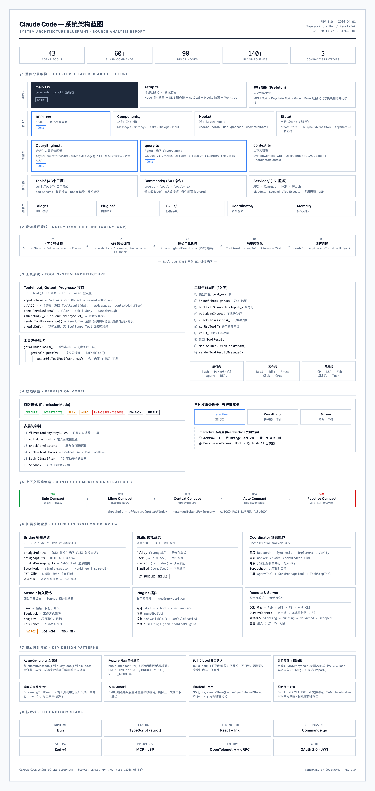

# Skills

My personal collection of AI agent skills.

## Overview

This repository contains reusable skills that extend AI agent capabilities. Each skill is a self-contained module that teaches an agent how to perform specific tasks.

## Project Structure

```
skills/
├── blueprinter/      # Technical diagram generation skill
└── README.md
```

## Available Skills

| Skill | Description |
|-------|-------------|
| [blueprinter](./blueprinter/) | Generate technical diagrams in Flat Engineering Blueprint style using HTML/CSS |

### Example: Blueprinter Output



## Skill Structure

Each skill contains:

```
skill-name/
└── SKILL.md    # Skill definition with instructions for the agent
```

### SKILL.md Format

```yaml
---
name: skill-name
description: When and how to use this skill
---

# Skill content and instructions...
```

## License

MIT
## Star History

[](https://www.star-history.com/?repos=yofine%2Fskills&type=date&legend=top-left)

<br/>
