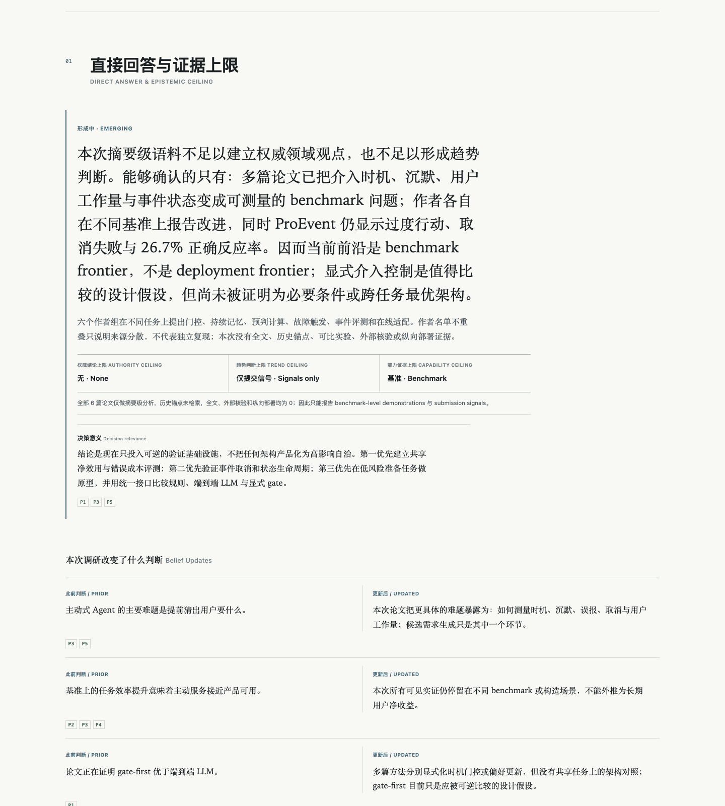
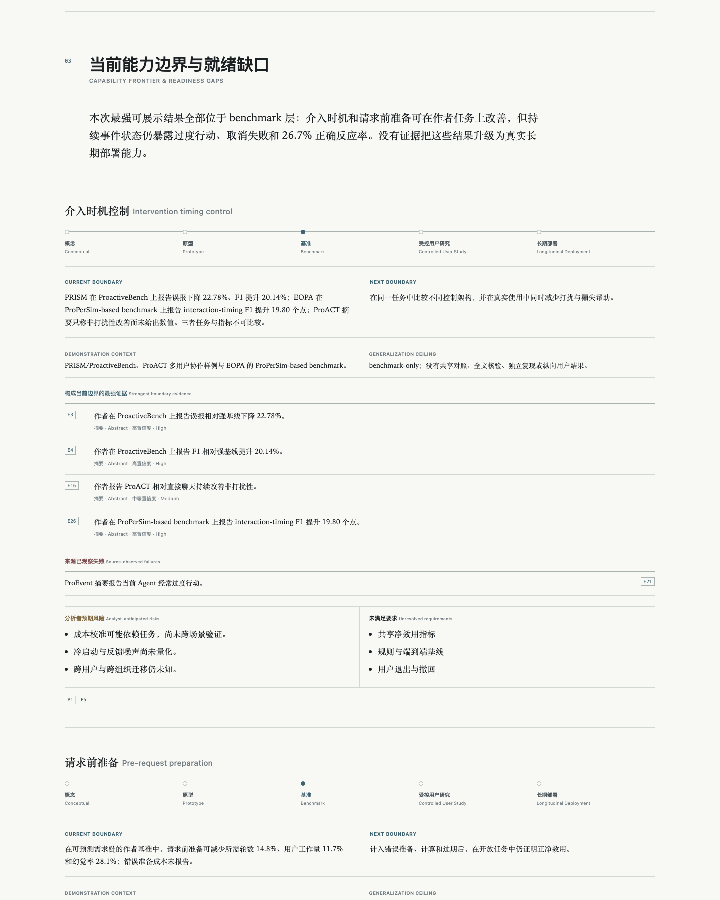
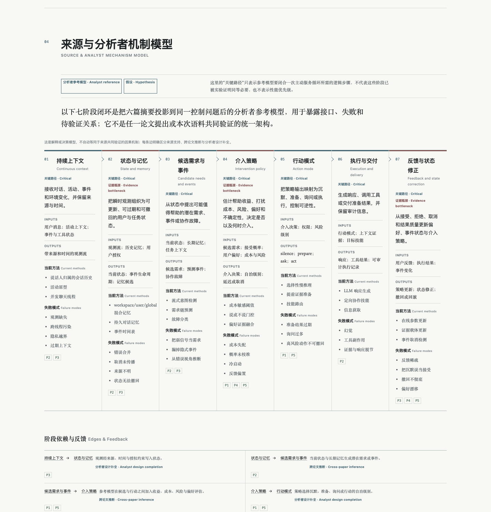

# Skills

My personal collection of AI agent skills.

## Overview

This repository contains reusable skills that extend AI agent capabilities. Each skill is a self-contained module that teaches an agent how to perform specific tasks.

## Project Structure

```
skills/
├── arxiv-paper-report/  # arXiv field-intelligence and decision report skill
├── blueprinter/          # Technical diagram generation skill
├── brief/                # Brief site template and report publishing skill
├── design-hub/           # Local design-system library and extraction skill
├── ten-defeats/           # Judgment and completion guardrail skill
└── README.md
```

## Available Skills

| Skill | Description |
|-------|-------------|
| [arxiv-paper-report](./arxiv-paper-report/) | Turn an arXiv-centered literature corpus into evidence-bounded field beliefs, capability frontiers, technical options, and explicit decisions in validated JSON and standalone HTML |
| [blueprinter](./blueprinter/) | Generate technical diagrams in Flat Engineering Blueprint style using HTML/CSS |
| [brief](./brief/) | Initialize a Brief React/Vite report site, generate analysis reports, and publish them into the site |
| [design-hub](./design-hub/) | Initialize and manage a local Design System Hub, extract systems from screenshots, and expose Agent-readable exports |
| [ten-defeats](./ten-defeats/) | Guard non-trivial software work against action theater, tool-substituted design, proxy validation, and premature completion |

### arXiv Decision Intelligence Report

Use `arxiv-paper-report` when the goal is not merely to collect or summarize papers, but to decide what a vertical field currently supports. It turns atomic source evidence into testable propositions, demonstrated capability boundaries, a visibly labeled mechanism model, comparable or non-comparable technical options, transition signals, five-dimensional maturity, decision consequences, and leading indicators.

The report is deliberately explicit when the evidence cannot support an authoritative view, historical trend, deployment claim, or route ranking. Its primary artifacts are a strict JSON research record and a deterministic, bilingual standalone HTML report.







Example requests:

- "Research proactive AI agents and tell me what is demonstrated, what remains unknown, and what we should validate next."
- "Map the technical frontier of this field and produce an evidence-traceable Chinese/English HTML report."
- "Compare the available technical options without ranking approaches that were evaluated on incompatible tasks."
- "Determine whether recent papers represent a structural transition or only a cluster of submission signals."

See the [skill README](./arxiv-paper-report/README.md) for its evidence model, dependencies, artifact contract, and local validation commands.

### Example: Blueprinter Output


### Brief

Use the `brief` skill to create and operate a professional research brief site. It can initialize a new Brief site, turn source material into standalone Brief-style analysis reports, publish those reports into the site, and start the local preview server.

[Live example](https://brief.blueprinter.ai/)


Example requests:

- "Use the brief skill to initialize a new site and start it locally."
- "Use brief to analyze this article, generate a report, and publish it to my Brief site."
- "Use brief to add this codebase analysis as a new report and make it the featured report."
- "Use brief to build the site and tell me where the production output is."

### Design System Hub

Use the `design-hub` skill to initialize and operate a local React/Vite design-system library. It can extract a coherent system from screenshots or written direction, generate a source-specific and privacy-safe Live Mock, and expose Copy Tokens, `DESIGN.md`, standalone HTML, and an Agent-oriented API document.


New sites default to `~/design-hub` and include the current MuleRun, Raft, QoderWork, and Superset design systems. New systems are appended as isolated entries without rewriting existing content.

Example requests:

- "Use design-hub to initialize the local site and start the service."
- "Extract a design system from these screenshots and add it to my Hub."
- "Regenerate this system's Live Mock while preserving the existing entries."
- "Export the design system as DESIGN.md and show me the Agent API endpoint."

## License

MIT
## Star History

[](https://www.star-history.com/?repos=yofine%2Fskills&type=date&legend=top-left)

<br/>
