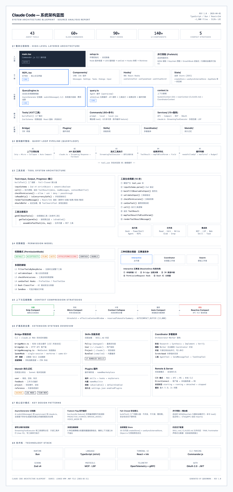
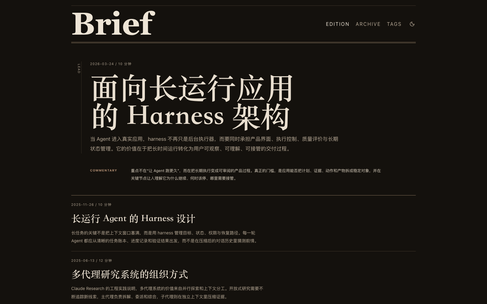
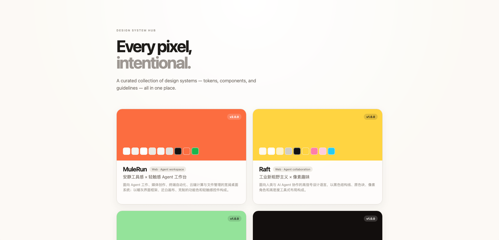

# Skills

My personal collection of AI agent skills.

## Overview

This repository contains reusable skills that extend AI agent capabilities. Each skill is a self-contained module that teaches an agent how to perform specific tasks.

## Project Structure

```
skills/
├── blueprinter/      # Technical diagram generation skill
├── brief/            # Brief site template and report publishing skill
├── design-hub/       # Local design-system library and extraction skill
└── README.md
```

## Available Skills

| Skill | Description |
|-------|-------------|
| [blueprinter](./blueprinter/) | Generate technical diagrams in Flat Engineering Blueprint style using HTML/CSS |
| [brief](./brief/) | Initialize a Brief React/Vite report site, generate analysis reports, and publish them into the site |
| [design-hub](./design-hub/) | Initialize and manage a local Design System Hub, extract systems from screenshots, and expose Agent-readable exports |

### Example: Blueprinter Output



### Brief

Use the `brief` skill to create and operate a professional research brief site. It can initialize a new Brief site, turn source material into standalone Brief-style analysis reports, publish those reports into the site, and start the local preview server.

[Live example](https://brief.blueprinter.ai/)



Example requests:

- "Use the brief skill to initialize a new site and start it locally."
- "Use brief to analyze this article, generate a report, and publish it to my Brief site."
- "Use brief to add this codebase analysis as a new report and make it the featured report."
- "Use brief to build the site and tell me where the production output is."

### Design System Hub

Use the `design-hub` skill to initialize and operate a local React/Vite design-system library. It can extract a coherent system from screenshots or written direction, generate a source-specific and privacy-safe Live Mock, and expose Copy Tokens, `DESIGN.md`, standalone HTML, and an Agent-oriented API document.



New sites default to `~/design-hub` and include the current MuleRun, Raft, QoderWork, and Superset design systems. New systems are appended as isolated entries without rewriting existing content.

Example requests:

- "Use design-hub to initialize the local site and start the service."
- "Extract a design system from these screenshots and add it to my Hub."
- "Regenerate this system's Live Mock while preserving the existing entries."
- "Export the design system as DESIGN.md and show me the Agent API endpoint."

## License

MIT
## Star History

[](https://www.star-history.com/?repos=yofine%2Fskills&type=date&legend=top-left)

<br/>
